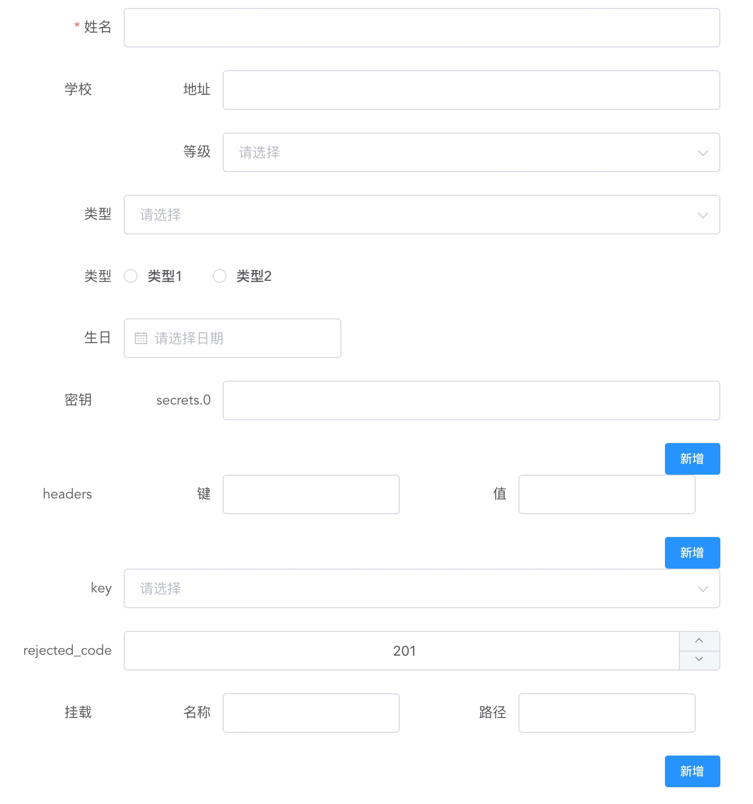

# vue-form

A JSON Scheme parse for Form with Element-UI

- support `switch`,`input`,`input-number`,`select`,`radio`,`checkbox`,`date` components.
- support `minimun`,`maximun`,`minLength`,`maxlenght`,`pattern` form rules.
- support array & object nest
- support simple object without properties
- support anyOf

## How to use

```bash
npm i @secrets/vue-form
```

```js
import elementUI from "element-ui";
import vueForm from "@secrets/vue-form";
Vue.use(elementUI);
Vue.use(vueForm);
```

## demo

```js
const schema = {
  title: "basic",
  type: "object",
  buttons: ["confirm"],
  properties: {
    name: {
      type: "string",
      title: "姓名"
    },
    school: {
      title: "学校",
      type: "object",
      properties: {
        address: {
          title: "地址",
          type: "string"
        },
        category: {
          title: "等级",
          type: "select",
          options: [
            {
              label: "高中",
              value: "major"
            },
            {
              label: "初中",
              value: "minor"
            }
          ]
        }
      }
    },
    type: {
      type: "select",
      title: "类型",
      options: [
        {
          label: "类型1",
          value: "type1"
        },
        {
          label: "类型2",
          value: "type2"
        }
      ]
    },
    radio: {
      type: "radio",
      title: "类型",
      options: [
        {
          label: "类型1",
          value: "type1"
        },
        {
          label: "类型2",
          value: "type2"
        }
      ]
    },
    date: {
      type: "date",
      title: "生日"
    },
    secrets: {
      type: "array",
      title: "密钥",
      items: {
        type: "string"
      }
    },
    headers: {
      type: "object" // get a basic object
    },
    key: {
      // like a select
      enum: [
        "remote_addr",
        "server_addr",
        "http_x_real_ip",
        "http_x_forwarded_for"
      ],
      type: "string"
    },
    rejected_code: {
      default: 201,
      minimum: 200, //minimum maximum
      type: "integer"
    },
    configmaps: {
      type: "array",
      title: "挂载",
      items: {
        type: "object",
        properties: {
          name: {
            type: "string",
            title: "名称"
          },
          path: {
            type: "string",
            title: "路径"
          }
        }
      }
    }
  },
  required: ["name", "phone"]
};
```

```html
<vue-form ref="form" :schema="schema"></vue-form>
```

### API

```js
this.$refs.form.validate(); // validate the form
```

```js
this.$ref.form.getData(); // get the realtime data
```



## 打包

```bash
yarn build
// or
npm run build
```

## 本地测试

1. 本项目中

```bash
yarn build  // 打包出来
yarn link //加入到本地全局模块
```

2. 目标项目

```bash
yarn link  @secrets/vue-form
```
